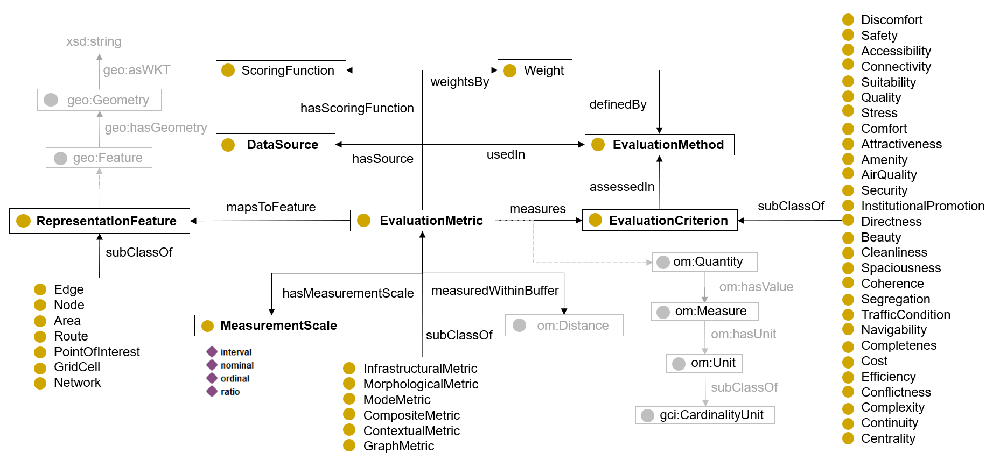

# Bike Network Evaluation Metric Ontology (VeloNEMO)

We have developed VeloNEMO, an ontology to standardize and streamline bike network evaluation metrics from a set of existing scholarly papers. We formalized these metrics according to VeloNEMO and created a graph-database as well as tools to query and visualize the overview of different metric properties. 

### Setup Instructions

Ensure you have Python 3.11 installed. If not, download it from Python's official website. Clone this repository and navigate into the project directory.
Run `pip install -r requirements.txt` to install required external dependencies. 

To set up a graph database (Blazegraph) on Windows:
1. `blazegraph.jar` needs to be downloaded from https://github.com/blazegraph/database/releases and stored in a directory. 
2. Create a `run_db.bat` file in the same folder as the `blazegraph.jar` with the following content: `java -server -Xmx4g -jar blazegraph.jar`.
3. Run the `run_db.bat` file to start the database. The database can then be accessed via an url and updated via a web endpoint with the generated nquad file. 

### File description

* `paths_example.ini`: example config file with: 1) input folder with the csv data for metrics, 2) output folder where generated metric nquads and descriptive plots will be saved to, and 3) the url for graph-database endpoint. You need to have `paths.ini` with your specific paths and endpoint. 
* `VeloNEMO.owl`: VeloNEMO ontology .owl file.
* `onto_manager.py`: file containing concept constants for VeloNEMO, Units of Measure Ontology (OM) and Foundation Ontology for Global City Indicators (GCI).
* `metrics_to_nquads.py`: Functions to generate nquads representing metrics in the input file according to VeloNEMO.
* `write_nquads.py`: generates nquads that can be then stored in a graph database.
* `metric_visualisation.py`: Functions to query the graph database for different metrics and to plot descriptive overview. 
* `plot_metric_overview.py`: queries the graph database for metrics and its properties and plots descriptive overview. At this point, the database needs to be preloaded with metric nquads and running.

### Input data example

We provide an example input file `metrics.xlsx` in the `example_data` folder that gives a better idea of how the input data should look like. Specifically, following column names are necessary:`EvaluationMetric` (metric name, preferably reused), `MetricType` (one of the six thematic metrics types from VeloNEMO), `EvaluationMethod` (DOI or other identifier), `EvaluationCriterion` (a qualitative criteria such as Accessibility, Stress, Connectivity, etc., preferably from VeloNEMO), `RepresentationFeature` (geometric feature to which metric values are linked or aggregated on), `ScoringFunction` (e.g., Likert scale, rank between 1-10, etc.), `MeasurementScale` (nominal, ordinal, interval, ratio), `Unit` (refer to OM unit instances), `UnitType` (refer to OM unit types), `Function` (refer to OM - e.g., om:sum, om:average, om:mean), `Buffer` (numeric buffer value within which the metric values are aggregated, e.g., 200), `BufferUnit` (refer to OM unit instances, but likely om:metre of om:kilometere), `Comment` (original metric description), `Parts` (metric names for composite metric parts).
